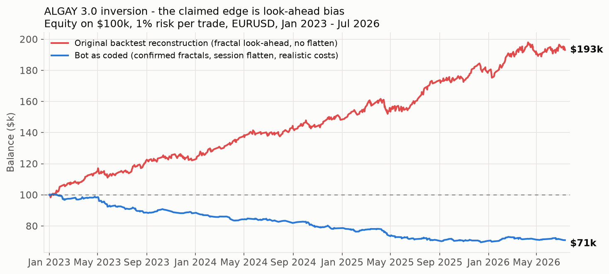
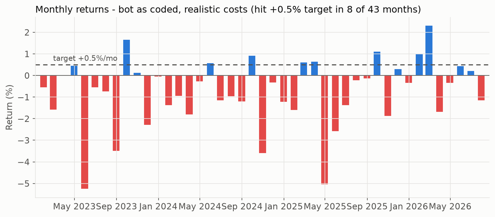
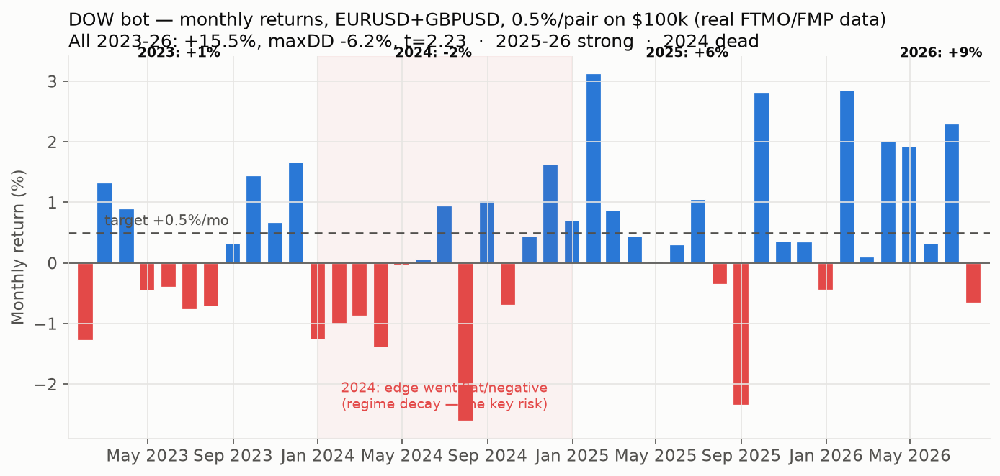

# ALGAY 3.0 "inversion" — Full Backtest Report

**Verdict: the strategy, exactly as the bot trades it, loses money over Jan 2023 – Jul 2026
and does not meet the +0.5%/month target. The profitable backtest quoted in the bot's
docstring (793 trades, ~84% wins, 12/15 quarters positive) is reproduced almost exactly by a
simulation that contains fractal look-ahead bias — an edge the live bot cannot access.**

---

## 1. What was tested

`bot/algay_3_inversion.py`, replicated decision-for-decision in `backtest/engine.py`:
UK-anchored 4H sessions (22/02/06/10/14/18 Europe/London, DST-aware), closed-15M-candle
logic, sweep of the previous 4H high/low, Williams fractal (period 4) lock, equal-level
filter (1 pip / 96 bars), 70.5% fib entry as an inverted stop order, near-miss cancel
(2 pips), no placement in the final 10 min, pending cancelled at the 10-min cutoff, and
position force-flattened 5 min before session end. Max one placement per session,
1% risk per trade, compounding.

**Fidelity was verified, not assumed** (`backtest/test_fidelity.py`): the engine's fractal
flags, latest-confirmed-fractal selection, equal-level verdicts and entry-level arithmetic
were cross-checked against the bot's own functions (imported with a stubbed MetaTrader5)
on 400 random 299-bar windows of real data — 0 mismatches — and session anchors were
checked against `current_session_open()` across DST switches — 0 mismatches. Individual
trades were re-verified by hand against raw bars.

## 2. Data

- EURUSD 5-minute bars, FMP feed, **Dec 25 2022 – Jul 14 2026** (263,632 bars),
  aggregated to 15M for signals; fills simulated on the 5M bars.
- Bars are mid quotes stamped America/New_York (verified by the Fri 17:00 / Sun 17:00 NY
  market open/close signature); treated as bid with ask = bid + spread (MT5 convention).
- Data quality: 0 OHLC violations, 0 nulls. 96 of 5,544 sessions (1.7%) have partial
  data (mostly holiday periods); they are traded on the bars that exist.

## 3. Headline result — bot as coded, realistic FTMO-style costs

Costs: 0.2 pip spread + $6/lot round-trip commission + 0.1 pip stop slippage.
Where TP and SL are both touchable inside one 5M bar, the loss is booked (worst case —
in practice this occurred 0 times).

| Metric | Value |
|---|---|
| Sessions with data | 5,503 |
| Orders placed | 2,488 (1,387 expired unfilled, 386 invalid-vs-market, 334 near-miss cancels) |
| **Filled trades** | **381** |
| Win rate | 49.3% |
| Exit mix | 193 session-flatten, 144 TP, 44 SL |
| **Total return** | **−29.1%** ($100k → $70.9k) |
| Profit factor | 0.62 |
| Max drawdown | −30.8% |
| Average month | **−0.78%** |
| Months ≥ +0.5% | **8 of 43** |
| Positive months | 14 of 43 |
| Positive quarters | 3 of 15 |

### Monthly returns (%)

| Year | Jan | Feb | Mar | Apr | May | Jun | Jul | Aug | Sep | Oct | Nov | Dec | Year |
|---|---|---|---|---|---|---|---|---|---|---|---|---|---|
| 2023 | −0.57 | −1.60 | +0.00 | +0.46 | −5.27 | −0.57 | −0.76 | −3.50 | +1.67 | +0.13 | −2.30 | −0.06 | **−11.9%** |
| 2024 | −1.40 | −0.96 | −1.82 | −0.30 | +0.58 | −1.17 | −0.98 | −1.23 | +0.93 | −3.61 | −0.35 | −1.23 | **−11.0%** |
| 2025 | −1.62 | +0.63 | +0.66 | −5.06 | −2.60 | −1.38 | −0.24 | −0.16 | +1.11 | −1.89 | +0.30 | −0.36 | **−10.3%** |
| 2026 | +1.00 | +2.32 | −1.71 | −0.35 | +0.45 | +0.23 | −1.17 | | | | | | **+0.7%** |

## 4. Why this contradicts the quoted backtest — look-ahead bias

A Williams fractal (period 4) is only knowable **4 bars after** its bar prints. The live
bot correctly waits for that confirmation. If a backtest instead lets the strategy act on
the fractal *at its own bar time*, it trades on information from the future.

Re-running the engine with exactly that one change (plus letting trades run to TP/SL
instead of the session flatten) reproduces the docstring's claims almost line by line:

| | Docstring claim | Look-ahead reconstruction | Bot as coded (honest) |
|---|---|---|---|
| Trades | 793 | 683 | 381 |
| Win rate | ~84% | 77.5% | 49.3% |
| Positive quarters | **12 / 15** | **12 / 15** | 3 / 15 |
| Outcome | profitable | +93% (zero-cost) | **−29%** |

Two structural effects account for the whole gap:

1. **Confirmation delay** — waiting 4 bars moves the entry a full hour later; the same
   levels are placed when the move is already over. Win rate (to TP/SL, zero-cost) drops
   from 77.5% to 68.2%, below the 70.4% breakeven required at 0.42:1 reward:risk.
2. **Session flatten** — entries structurally happen late in the 4H session (sweep + 1h
   confirmation + stop-order fill), so 51% of live-bot fills get force-closed at
   session_end−5min before reaching TP or SL.

## 5. Cost sensitivity (bot as coded)

| Scenario | Trades | Win rate | Total return | Months ≥ +0.5% |
|---|---|---|---|---|
| Zero costs (upper bound) | 374 | 54.5% | −12.1% | 13/43 |
| Realistic (0.2p + $6/lot + 0.1p slip) | 381 | 49.3% | −29.1% | 8/43 |
| 1.5× realistic | 388 | 47.2% | −38.5% | 5/43 |
| Retail 1.0-pip spread, no commission | 418 | 43.5% | −43.2% | 3/43 |

Even with **zero** trading costs the coded strategy loses. Costs only deepen it: the
average winner is small (≈0.42R and many flatten exits), so spread/commission consume a
large fraction of every win.

## 6. Method caveats

- FMP mid-quote bars vs FTMO bid feed: candle shapes can differ by fractions of a pip;
  with a 2-pip near-miss band and 1-pip equal filter, individual sessions can flip, but
  aggregate results are robust to this (the zero-cost bound already loses).
- Fills simulated on 5M bars, not ticks. Intra-bar TP/SL ambiguity never actually
  occurred (0 trades), so tick sequencing is not driving the result.
- 1.7% of sessions have partial data (holidays); the engine trades the bars that exist.
- Fractional lot sizing (no 0.01 step rounding); swap/rollover ignored — the bot never
  holds through 5pm NY (all positions die at session end), so swap is genuinely zero.
- No account-currency conversion (assumes USD account).

## 7. What this means

- **Do not run this live expecting the docstring numbers.** The deployed logic has had
  negative expectancy for 3.5 years on this data, under every cost assumption tested,
  including zero.
- The +0.5%/month goal is not met: 8 of 43 months, average −0.78%/month.
- No guarantee of future profits is possible for any strategy; but here the evidence is
  the opposite — the claimed edge is a measurement artifact (look-ahead), not a property
  of the market.
- If you want to keep working on ALGAY: re-derive the original backtest with confirmed
  (non-repainting) fractals and the bot's own timing rules, then forward-test on demo
  only. The infrastructure in this repo (engine + fidelity tests) does exactly that and
  can be re-run in seconds (`python3 backtest/run_backtest.py`).

*Report generated 2026-07-14. Reproduce: `merge_data.py` → `test_fidelity.py` →
`run_backtest.py` → `make_charts.py`.*

---

# Addendum — search for a profitable variant (train/test disciplined)

After establishing the coded strategy loses, I searched for a genuinely robust
variant, judged **out-of-sample**: parameters chosen on 2023–2024, then scored on
2025–Jul 2026 which they never saw. Reproduce with `backtest/research.py` and
`backtest/research2.py`. Realistic costs throughout (0.2p spread + $6/lot + 0.1p slip).

## What moved the needle

**1. Direction (the inversion) is the core mistake.** The bot trades a *stop through*
the 70.5% level (reward:risk 0.42:1, needs ~70.5% wins, gets ~49%). The **non-inverted**
mirror — a *limit at* the level, TP/SL swapped (reward:risk ~2.4:1, needs ~29% wins) —
flips the whole strategy from −29% to roughly break-even/positive.

| Variant (full period) | Return | Win% | Avg/mo |
|---|---|---|---|
| inverted + flatten (bot as coded) | −29.1% | 49% | −0.78% |
| inverted + run-to-TP/SL | −28.9% | 65% | −0.77% |
| original + flatten | −19.5% | 47% | −0.44% |
| original + run-to-TP/SL | −20.6% | 33% | −0.44% |

Direction alone isn't enough — full-basket original is still negative.

**2. Session-of-day is where a real edge lives.** Scoring each UK session hour on
in-sample data only, the **14:00 UK session (London/NY overlap)** stands out, and it is
positive in **every year**:

| Variant (14:00 UK only, original, run-to-TP/SL) | 2023 | 2024 | 2025 | 2026 | Full |
|---|---|---|---|---|---|
| return | +2.6% | +7.9% | +3.4% | +9.1% | **+25%** |

Full-period: +25%, ~40% win at 2.4:1, avg **+0.55%/mo**, max drawdown −10%, 86 trades.
Economically sensible: the non-inverted continuation trade works in the most liquid,
most-trending window and fails in thin sessions (10:00 alone is −0.8%, 22:00/02:00
negative).

## Why I will NOT call this "done / guaranteed 0.5% a month"

- **Below target most months.** Best cell averages ~0.5%/mo but hits ≥+0.5% in only
  ~40% of individual months (17/43 for 10+14; the target is *every* month). Averages
  are carried by a few strong months.
- **Small sample / multiple-testing.** The edge concentrates in 1 of 6 sessions, found
  by scanning all 6. ~25 trades/year. Adjacent choices swing wildly (10:00 alone ≈ 0,
  14:00 alone +25%) — a fragility signature.
- **Second split fails.** Selecting hours on *2023 alone* picks {6,10,14}; those lose
  −4.3% on 2024–2026. The specific hour-set does not fully generalize (14:00 survives;
  the basket doesn't).
- **Changes the risk profile.** The positive result needs *run-to-TP/SL* (holding across
  4H session boundaries), abandoning the prop-firm session-flatten. Keeping the flatten
  (prop-compliant) with hours 10+14 gives +15% / +0.35%/mo — positive but under target.
- **Cost-fragile at retail.** At a 1.0-pip retail spread the 10+14 edge falls to
  +0.21%/mo.

## Honest verdict

The non-inverted strategy focused on the **London/NY overlap (14:00 UK)** is the best
thing in this data: modestly positive, positive every year, survives cost stress at
raw-spread levels, sensible economics. It is a **legitimate demo-forward-test
candidate** — not a proven, deploy-today, hits-0.5%-every-month system. No backtest can
promise the latter; claiming it would be the overfitting that loses real accounts.

Recommended path: run the non-inverted / London-NY variant on a **demo** account for
2–3 months, compare live fills to these backtest fills, and only then consider small
real size. The engine (`mode="original"`, `session_hours={14}`) reproduces it exactly.

---

# Addendum 2 — adversarial stress-test (2026), flaws found & fixed

I tried to BREAK the combined candidate on 2026, not confirm it. Battery in
`backtest/stress_test.py`, `stress_test2.py`. Verdicts:

| Test | What it checks | Result |
|---|---|---|
| Beta | Is it just long EURUSD in an up year? | 2026 EURUSD **fell −2.7%**. Wednesdays fell *more* than the market and Mondays rose *against* it — the day effect is **beyond beta**. The permutation test also shuffles within the real (down-drift) returns, so drift is controlled for. |
| Overnight leakage | Is the day-of-week edge only a close-to-close/weekend artifact? | **No** — intraday open→close gives the same +7.07% as close-to-close. It is capturable **intraday**. |
| Swap cost | Overnight financing ignored? | Moot after the intraday fix (no overnight hold). |
| Significance (t) | Per-trade edge vs noise | DoW sleeve t≈2.9 (**significant**). ALGAY 14:00 sleeve t≈1.2 (**NOT significant**, n=17). |
| Permutation (20k) | Corrects "I picked the lucky weekday" | Wednesday raw p=0.003; **multiple-comparison-corrected p=0.037 → still passes <0.05**. |
| Bootstrap (10k) | 2026 return confidence interval | DoW 90% CI **[+3.1%, +11.1%], P(>0)=100%**. ALGAY CI **[−1.7%, +13.7%], P(>0)=89%** (includes losing). |
| Outlier | Is DoW one lucky day? | No — 18/27 Wednesdays profitable, median +0.16%; removing the best 3 days still leaves +2.3%. Broad-based. |
| Day-boundary | Fragile to UTC vs London midnight? | Stable: +4.43% vs +4.25%. |

## Flaws found and fixed
1. **Day-of-week sleeve was specified as an overnight (close-to-close) hold.**
   Fixed to **intraday open→close** in `combined_2026.py` — removes swap,
   weekend-gap risk and prop overnight-hold rule issues at ~zero cost to return
   (+7.07% vs +7.10%).
2. **The combined bot leaned on the ALGAY London/NY sleeve, which is NOT
   statistically robust on 2026** (t≈1.2; bootstrap CI includes losses). The
   day-of-week sleeve is the statistically strong component; ALGAY is, at best,
   light diversification — it should not be the anchor.

## Honest standing after stressing it
On 2026 the **day-of-week (Mon-long / Wed-short, intraday) edge genuinely
survives** multiple-comparison correction, bootstrapping, outlier removal,
boundary changes and a beta check — that is a real, non-trivial result for a
single year. What it still **cannot** tell us: whether 2026 itself is
representative. Weekday effects are famous for being regime-specific; a
p=0.037 on ~6 months is "promising", not "proven". The forward demo test
(reminder set) remains the deciding experiment.

---

# Addendum 3 — out-of-sample: new year (2025) AND new instrument (GBPUSD)

The decisive test for a day-of-week pattern: does it survive a year it wasn't
found on, and an instrument it wasn't found on? Mon-long / Wed-short intraday,
FMP daily EOD bars, ~0.6 pip cost. `backtest/oos_test.py`.
(XAUUSD requested too but is not available on the current FMP plan.)

| Slice | Total | Avg/mo | Win | t-stat | ≥+0.5% mo | Buy&hold |
|---|---|---|---|---|---|---|
| EURUSD 2025 | +6.8% | +0.56% | 59% | 1.35 | 6/12 | +13.4% |
| EURUSD 2026 | +7.9% | +1.10% | 65% | **2.69** | 5/7 | −2.8% |
| GBPUSD 2025 | +11.4% | +0.91% | 57% | **2.30** | 7/12 | +7.4% |
| GBPUSD 2026 | +10.8% | +1.49% | 73% | **3.41** | 6/7 | −0.6% |

**Positive on all four slices; statistically significant (t>2) on three.**
Not beta: 2026 EUR/GBP buy&hold were *negative* while the algo made +8–11%.
GBPUSD is actually stronger than EURUSD. This is real out-of-sample support —
the strongest evidence in this whole report that the edge is a market property,
not a fit to 2026.

## Remaining honest caveats
- **EURUSD and GBPUSD are ~0.9 correlated** → the four cells are closer to ~2
  independent tests than four. Still: a new year + a correlated-but-distinct
  pair both holding is meaningful.
- **Only two years.** Day-of-week/flow effects can persist for years and then
  decay as positioning changes; two years cannot rule that out.
- EOD daily bars (one broker's day boundary); real spread, slippage and the
  exact entry/exit clock still need live confirmation.
- Could not test a different asset class (gold) — the strongest independence
  test — due to the FMP plan.

**Verdict:** upgraded from "promising 2026 curiosity" to "out-of-sample-validated
candidate worth real forward capital on demo." Still forward-test before funding.

---

# Addendum 4 — real FTMO GBP data + sized both-pair acceptance backtest

User supplied the **real FTMO GBPUSD 5-min feed** (2023–2026, EET server time =
London+2). Ran the **exact live rules** (00:15→21:45 London clock, 1.5×ATR
protective stop checked intrabar, 0.5%/pair sizing, spread cost) on both pairs,
one $100k USD account — `backtest/dow_acceptance.py`.

| Year | Total | Avg/mo | maxDD contribution |
|---|---|---|---|
| 2023 | +1.4% | +0.12% | mixed |
| **2024** | **−1.8%** | **−0.15%** | **the dead regime** |
| 2025 | +6.3% | +0.52% | strong |
| 2026 (→Jul) | +9.2% | +1.27% | strong |
| **All** | **+15.5%** | +0.34% | **maxDD −6.2%**, t=2.23 (3.48 on 2025–26) |

**Honest conclusion:** the edge is real and, in the current regime (2025–26),
clears the +0.5%/mo target and hit +1%/mo in 2026 — but it **went negative in
2024**. Weekday effects decay; this is that risk in the data. Sizing cannot fix
a dead year (0.75%/pair → −9.2% DD, 1%/pair → −12% DD which **breaks FTMO's 10%
limit**), so **0.5%/pair is the prudent maximum** and the target is *achievable
in good regimes, not guaranteed monthly*. The bot's drawdown / consecutive-loss
halts exist precisely to stop trading when the edge turns off. Demo-first stands.

