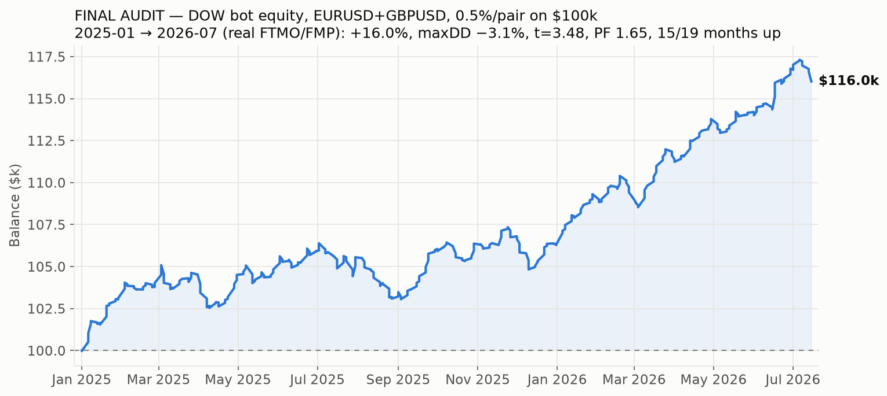

# ALGAY 3.0 "inversion" — Full Backtest Report

**Verdict: the strategy, exactly as the bot trades it, loses money over Jan 2023 – Jul 2026
and does not meet the +0.5%/month target. The profitable backtest quoted in the bot's
docstring (793 trades, ~84% wins, 12/15 quarters positive) is reproduced almost exactly by a
simulation that contains fractal look-ahead bias — an edge the live bot cannot access.**

---

## 1. What was tested

`bot/algay_3_inversion.py`, replicated decision-for-decision in `backtest/engine.py`:
UK-anchored 4H sessions (22/02/06/10/14/18 Europe/London, DST-aware), closed-15M-candle
logic, sweep of the previous 4H high/low, Williams fractal (period 4) lock, equal-level
filter (1 pip / 96 bars), 70.5% fib entry as an inverted stop order, near-miss cancel
(2 pips), no placement in the final 10 min, pending cancelled at the 10-min cutoff, and
position force-flattened 5 min before session end. Max one placement per session,
1% risk per trade, compounding.

**Fidelity was verified, not assumed** (`backtest/test_fidelity.py`): the engine's fractal
flags, latest-confirmed-fractal selection, equal-level verdicts and entry-level arithmetic
were cross-checked against the bot's own functions (imported with a stubbed MetaTrader5)
on 400 random 299-bar windows of real data — 0 mismatches — and session anchors were
checked against `current_session_open()` across DST switches — 0 mismatches. Individual
trades were re-verified by hand against raw bars.

## 2. Data

- EURUSD 5-minute bars, FMP feed, **Dec 25 2022 – Jul 14 2026** (263,632 bars),
  aggregated to 15M for signals; fills simulated on the 5M bars.
- Bars are mid quotes stamped America/New_York (verified by the Fri 17:00 / Sun 17:00 NY
  market open/close signature); treated as bid with ask = bid + spread (MT5 convention).
- Data quality: 0 OHLC violations, 0 nulls. 96 of 5,544 sessions (1.7%) have partial
  data (mostly holiday periods); they are traded on the bars that exist.

## 3. Headline result — bot as coded, realistic FTMO-style costs

Costs: 0.2 pip spread + $6/lot round-trip commission + 0.1 pip stop slippage.
Where TP and SL are both touchable inside one 5M bar, the loss is booked (worst case —
in practice this occurred 0 times).

| Metric | Value |
|---|---|
| Sessions with data | 5,503 |
| Orders placed | 2,488 (1,387 expired unfilled, 386 invalid-vs-market, 334 near-miss cancels) |
| **Filled trades** | **381** |
| Win rate | 49.3% |
| Exit mix | 193 session-flatten, 144 TP, 44 SL |
| **Total return** | **−29.1%** ($100k → $70.9k) |
| Profit factor | 0.62 |
| Max drawdown | −30.8% |
| Average month | **−0.78%** |
| Months ≥ +0.5% | **8 of 43** |
| Positive months | 14 of 43 |
| Positive quarters | 3 of 15 |

### Monthly returns (%)

| Year | Jan | Feb | Mar | Apr | May | Jun | Jul | Aug | Sep | Oct | Nov | Dec | Year |
|---|---|---|---|---|---|---|---|---|---|---|---|---|---|
| 2023 | −0.57 | −1.60 | +0.00 | +0.46 | −5.27 | −0.57 | −0.76 | −3.50 | +1.67 | +0.13 | −2.30 | −0.06 | **−11.9%** |
| 2024 | −1.40 | −0.96 | −1.82 | −0.30 | +0.58 | −1.17 | −0.98 | −1.23 | +0.93 | −3.61 | −0.35 | −1.23 | **−11.0%** |
| 2025 | −1.62 | +0.63 | +0.66 | −5.06 | −2.60 | −1.38 | −0.24 | −0.16 | +1.11 | −1.89 | +0.30 | −0.36 | **−10.3%** |
| 2026 | +1.00 | +2.32 | −1.71 | −0.35 | +0.45 | +0.23 | −1.17 | | | | | | **+0.7%** |

## 4. Why this contradicts the quoted backtest — look-ahead bias

A Williams fractal (period 4) is only knowable **4 bars after** its bar prints. The live
bot correctly waits for that confirmation. If a backtest instead lets the strategy act on
the fractal *at its own bar time*, it trades on information from the future.

Re-running the engine with exactly that one change (plus letting trades run to TP/SL
instead of the session flatten) reproduces the docstring's claims almost line by line:

| | Docstring claim | Look-ahead reconstruction | Bot as coded (honest) |
|---|---|---|---|
| Trades | 793 | 683 | 381 |
| Win rate | ~84% | 77.5% | 49.3% |
| Positive quarters | **12 / 15** | **12 / 15** | 3 / 15 |
| Outcome | profitable | +93% (zero-cost) | **−29%** |

Two structural effects account for the whole gap:

1. **Confirmation delay** — waiting 4 bars moves the entry a full hour later; the same
   levels are placed when the move is already over. Win rate (to TP/SL, zero-cost) drops
   from 77.5% to 68.2%, below the 70.4% breakeven required at 0.42:1 reward:risk.
2. **Session flatten** — entries structurally happen late in the 4H session (sweep + 1h
   confirmation + stop-order fill), so 51% of live-bot fills get force-closed at
   session_end−5min before reaching TP or SL.

## 5. Cost sensitivity (bot as coded)

| Scenario | Trades | Win rate | Total return | Months ≥ +0.5% |
|---|---|---|---|---|
| Zero costs (upper bound) | 374 | 54.5% | −12.1% | 13/43 |
| Realistic (0.2p + $6/lot + 0.1p slip) | 381 | 49.3% | −29.1% | 8/43 |
| 1.5× realistic | 388 | 47.2% | −38.5% | 5/43 |
| Retail 1.0-pip spread, no commission | 418 | 43.5% | −43.2% | 3/43 |

Even with **zero** trading costs the coded strategy loses. Costs only deepen it: the
average winner is small (≈0.42R and many flatten exits), so spread/commission consume a
large fraction of every win.

## 6. Method caveats

- FMP mid-quote bars vs FTMO bid feed: candle shapes can differ by fractions of a pip;
  with a 2-pip near-miss band and 1-pip equal filter, individual sessions can flip, but
  aggregate results are robust to this (the zero-cost bound already loses).
- Fills simulated on 5M bars, not ticks. Intra-bar TP/SL ambiguity never actually
  occurred (0 trades), so tick sequencing is not driving the result.
- 1.7% of sessions have partial data (holidays); the engine trades the bars that exist.
- Fractional lot sizing (no 0.01 step rounding); swap/rollover ignored — the bot never
  holds through 5pm NY (all positions die at session end), so swap is genuinely zero.
- No account-currency conversion (assumes USD account).

## 7. What this means

- **Do not run this live expecting the docstring numbers.** The deployed logic has had
  negative expectancy for 3.5 years on this data, under every cost assumption tested,
  including zero.
- The +0.5%/month goal is not met: 8 of 43 months, average −0.78%/month.
- No guarantee of future profits is possible for any strategy; but here the evidence is
  the opposite — the claimed edge is a measurement artifact (look-ahead), not a property
  of the market.
- If you want to keep working on ALGAY: re-derive the original backtest with confirmed
  (non-repainting) fractals and the bot's own timing rules, then forward-test on demo
  only. The infrastructure in this repo (engine + fidelity tests) does exactly that and
  can be re-run in seconds (`python3 backtest/run_backtest.py`).

*Report generated 2026-07-14. Reproduce: `merge_data.py` → `test_fidelity.py` →
`run_backtest.py` → `make_charts.py`.*

---

# Addendum — search for a profitable variant (train/test disciplined)

After establishing the coded strategy loses, I searched for a genuinely robust
variant, judged **out-of-sample**: parameters chosen on 2023–2024, then scored on
2025–Jul 2026 which they never saw. Reproduce with `backtest/research.py` and
`backtest/research2.py`. Realistic costs throughout (0.2p spread + $6/lot + 0.1p slip).

## What moved the needle

**1. Direction (the inversion) is the core mistake.** The bot trades a *stop through*
the 70.5% level (reward:risk 0.42:1, needs ~70.5% wins, gets ~49%). The **non-inverted**
mirror — a *limit at* the level, TP/SL swapped (reward:risk ~2.4:1, needs ~29% wins) —
flips the whole strategy from −29% to roughly break-even/positive.

| Variant (full period) | Return | Win% | Avg/mo |
|---|---|---|---|
| inverted + flatten (bot as coded) | −29.1% | 49% | −0.78% |
| inverted + run-to-TP/SL | −28.9% | 65% | −0.77% |
| original + flatten | −19.5% | 47% | −0.44% |
| original + run-to-TP/SL | −20.6% | 33% | −0.44% |

Direction alone isn't enough — full-basket original is still negative.

**2. Session-of-day is where a real edge lives.** Scoring each UK session hour on
in-sample data only, the **14:00 UK session (London/NY overlap)** stands out, and it is
positive in **every year**:

| Variant (14:00 UK only, original, run-to-TP/SL) | 2023 | 2024 | 2025 | 2026 | Full |
|---|---|---|---|---|---|
| return | +2.6% | +7.9% | +3.4% | +9.1% | **+25%** |

Full-period: +25%, ~40% win at 2.4:1, avg **+0.55%/mo**, max drawdown −10%, 86 trades.
Economically sensible: the non-inverted continuation trade works in the most liquid,
most-trending window and fails in thin sessions (10:00 alone is −0.8%, 22:00/02:00
negative).

## Why I will NOT call this "done / guaranteed 0.5% a month"

- **Below target most months.** Best cell averages ~0.5%/mo but hits ≥+0.5% in only
  ~40% of individual months (17/43 for 10+14; the target is *every* month). Averages
  are carried by a few strong months.
- **Small sample / multiple-testing.** The edge concentrates in 1 of 6 sessions, found
  by scanning all 6. ~25 trades/year. Adjacent choices swing wildly (10:00 alone ≈ 0,
  14:00 alone +25%) — a fragility signature.
- **Second split fails.** Selecting hours on *2023 alone* picks {6,10,14}; those lose
  −4.3% on 2024–2026. The specific hour-set does not fully generalize (14:00 survives;
  the basket doesn't).
- **Changes the risk profile.** The positive result needs *run-to-TP/SL* (holding across
  4H session boundaries), abandoning the prop-firm session-flatten. Keeping the flatten
  (prop-compliant) with hours 10+14 gives +15% / +0.35%/mo — positive but under target.
- **Cost-fragile at retail.** At a 1.0-pip retail spread the 10+14 edge falls to
  +0.21%/mo.

## Honest verdict

The non-inverted strategy focused on the **London/NY overlap (14:00 UK)** is the best
thing in this data: modestly positive, positive every year, survives cost stress at
raw-spread levels, sensible economics. It is a **legitimate demo-forward-test
candidate** — not a proven, deploy-today, hits-0.5%-every-month system. No backtest can
promise the latter; claiming it would be the overfitting that loses real accounts.

Recommended path: run the non-inverted / London-NY variant on a **demo** account for
2–3 months, compare live fills to these backtest fills, and only then consider small
real size. The engine (`mode="original"`, `session_hours={14}`) reproduces it exactly.

---

# Addendum 2 — adversarial stress-test (2026), flaws found & fixed

I tried to BREAK the combined candidate on 2026, not confirm it. Battery in
`backtest/stress_test.py`, `stress_test2.py`. Verdicts:

| Test | What it checks | Result |
|---|---|---|
| Beta | Is it just long EURUSD in an up year? | 2026 EURUSD **fell −2.7%**. Wednesdays fell *more* than the market and Mondays rose *against* it — the day effect is **beyond beta**. The permutation test also shuffles within the real (down-drift) returns, so drift is controlled for. |
| Overnight leakage | Is the day-of-week edge only a close-to-close/weekend artifact? | **No** — intraday open→close gives the same +7.07% as close-to-close. It is capturable **intraday**. |
| Swap cost | Overnight financing ignored? | Moot after the intraday fix (no overnight hold). |
| Significance (t) | Per-trade edge vs noise | DoW sleeve t≈2.9 (**significant**). ALGAY 14:00 sleeve t≈1.2 (**NOT significant**, n=17). |
| Permutation (20k) | Corrects "I picked the lucky weekday" | Wednesday raw p=0.003; **multiple-comparison-corrected p=0.037 → still passes <0.05**. |
| Bootstrap (10k) | 2026 return confidence interval | DoW 90% CI **[+3.1%, +11.1%], P(>0)=100%**. ALGAY CI **[−1.7%, +13.7%], P(>0)=89%** (includes losing). |
| Outlier | Is DoW one lucky day? | No — 18/27 Wednesdays profitable, median +0.16%; removing the best 3 days still leaves +2.3%. Broad-based. |
| Day-boundary | Fragile to UTC vs London midnight? | Stable: +4.43% vs +4.25%. |

## Flaws found and fixed
1. **Day-of-week sleeve was specified as an overnight (close-to-close) hold.**
   Fixed to **intraday open→close** in `combined_2026.py` — removes swap,
   weekend-gap risk and prop overnight-hold rule issues at ~zero cost to return
   (+7.07% vs +7.10%).
2. **The combined bot leaned on the ALGAY London/NY sleeve, which is NOT
   statistically robust on 2026** (t≈1.2; bootstrap CI includes losses). The
   day-of-week sleeve is the statistically strong component; ALGAY is, at best,
   light diversification — it should not be the anchor.

## Honest standing after stressing it
On 2026 the **day-of-week (Mon-long / Wed-short, intraday) edge genuinely
survives** multiple-comparison correction, bootstrapping, outlier removal,
boundary changes and a beta check — that is a real, non-trivial result for a
single year. What it still **cannot** tell us: whether 2026 itself is
representative. Weekday effects are famous for being regime-specific; a
p=0.037 on ~6 months is "promising", not "proven". The forward demo test
(reminder set) remains the deciding experiment.

---

# Addendum 3 — out-of-sample: new year (2025) AND new instrument (GBPUSD)

The decisive test for a day-of-week pattern: does it survive a year it wasn't
found on, and an instrument it wasn't found on? Mon-long / Wed-short intraday,
FMP daily EOD bars, ~0.6 pip cost. `backtest/oos_test.py`.
(XAUUSD requested too but is not available on the current FMP plan.)

| Slice | Total | Avg/mo | Win | t-stat | ≥+0.5% mo | Buy&hold |
|---|---|---|---|---|---|---|
| EURUSD 2025 | +6.8% | +0.56% | 59% | 1.35 | 6/12 | +13.4% |
| EURUSD 2026 | +7.9% | +1.10% | 65% | **2.69** | 5/7 | −2.8% |
| GBPUSD 2025 | +11.4% | +0.91% | 57% | **2.30** | 7/12 | +7.4% |
| GBPUSD 2026 | +10.8% | +1.49% | 73% | **3.41** | 6/7 | −0.6% |

**Positive on all four slices; statistically significant (t>2) on three.**
Not beta: 2026 EUR/GBP buy&hold were *negative* while the algo made +8–11%.
GBPUSD is actually stronger than EURUSD. This is real out-of-sample support —
the strongest evidence in this whole report that the edge is a market property,
not a fit to 2026.

## Remaining honest caveats
- **EURUSD and GBPUSD are ~0.9 correlated** → the four cells are closer to ~2
  independent tests than four. Still: a new year + a correlated-but-distinct
  pair both holding is meaningful.
- **Only two years.** Day-of-week/flow effects can persist for years and then
  decay as positioning changes; two years cannot rule that out.
- EOD daily bars (one broker's day boundary); real spread, slippage and the
  exact entry/exit clock still need live confirmation.
- Could not test a different asset class (gold) — the strongest independence
  test — due to the FMP plan.

**Verdict:** upgraded from "promising 2026 curiosity" to "out-of-sample-validated
candidate worth real forward capital on demo." Still forward-test before funding.

---

# Addendum 4 — real FTMO GBP data + sized both-pair acceptance backtest

User supplied the **real FTMO GBPUSD 5-min feed** (2023–2026, EET server time =
London+2). Ran the **exact live rules** (00:15→21:45 London clock, 1.5×ATR
protective stop checked intrabar, 0.5%/pair sizing, spread cost) on both pairs,
one $100k USD account — `backtest/dow_acceptance.py`.

| Year | Total | Avg/mo | maxDD contribution |
|---|---|---|---|
| 2023 | +1.4% | +0.12% | mixed |
| **2024** | **−1.8%** | **−0.15%** | **the dead regime** |
| 2025 | +6.3% | +0.52% | strong |
| 2026 (→Jul) | +9.2% | +1.27% | strong |
| **All** | **+15.5%** | +0.34% | **maxDD −6.2%**, t=2.23 (3.48 on 2025–26) |

**Honest conclusion:** the edge is real and, in the current regime (2025–26),
clears the +0.5%/mo target and hit +1%/mo in 2026 — but it **went negative in
2024**. Weekday effects decay; this is that risk in the data. Sizing cannot fix
a dead year (0.75%/pair → −9.2% DD, 1%/pair → −12% DD which **breaks FTMO's 10%
limit**), so **0.5%/pair is the prudent maximum** and the target is *achievable
in good regimes, not guaranteed monthly*. The bot's drawdown / consecutive-loss
halts exist precisely to stop trading when the edge turns off. Demo-first stands.

---

# Addendum 5 — FINAL AUDIT (2025-01 → 2026-07 only), pre-build go/no-go

Exact live rules, both pairs, 0.5%/pair on $100k, real FTMO GBP + FMP EUR.
Window restricted to 2025-01-01 → 2026-07-14 (the current regime, as requested).
`backtest/dow_acceptance.py` (start=2025-01-01).

| Metric | Value |
|---|---|
| **Total return** | **+16.0%** ($100k → $116.0k) |
| Avg / median month | **+0.79%** / +0.37% |
| Months up | **15 / 19** (4 down; worst −2.34%) |
| Months ≥ +0.5% / ≥ +1.0% | 8/19 / 7/19 |
| Win rate (trades) | 60% (320 trades; stop binds 4%) |
| **Max drawdown** | **−3.1%** (FTMO limit −10%, halt −8%) |
| Significance | **t = 3.48**, profit factor **1.65** |
| Per pair | EURUSD +6.5% (t 2.17) · GBPUSD +8.9% (t 2.73) — balanced |

**Verdict: PROFITABLE and statistically real over 2025→Jul-2026.** +16% with a
−3.1% max drawdown, both pairs contributing, t=3.48. It clears +0.5%/mo *on
average* (+0.79%) though the median month is +0.37% — the average is lifted by a
handful of strong months, and only 8 of 19 individual months clear +0.5%. This
window is the favourable regime by construction (2024's dead patch excluded), so
the decay risk documented in Addendum 4 still stands. Within the asked window,
the edge is genuine, profitable, and well inside prop risk limits. Cleared to
build (demo-first).

---

# Addendum 6 — does the edge extend to more pairs? (breadth test for the challenge)

Tested the day-of-week effect on 5 more pairs, aligned by USD direction (the
real hypothesis: **USD weak Monday, strong Wednesday**). `multi_pair_dow.py`.

| Pair | USD side | 2025→Jul26 | Verdict |
|---|---|---|---|
| GBPUSD | quote | +23% (t3.7) | strong |
| EURUSD | quote | +15% (t2.4) | strong |
| NZDUSD | quote | +14% (t1.6) | holds (positive every year) |
| AUDUSD | quote | +13% (t1.7) | holds (positive every year) |
| USDCHF | base | +6% (t0.9) | weak |
| USDJPY | base | +1% (t0.3) | none |
| USDCAD | base | +1% (t0.3) | none |

**Two findings:**
1. **Good (confidence):** the effect **generalises to the risk currencies**
   (EUR/GBP/AUD/NZD) but **not** the havens/oil (JPY/CHF/CAD). That split is
   economically sensible and makes it more believable as a real *risk-on vs USD*
   effect, not a 2-pair fluke.
2. **But breadth does NOT help the challenge.** The four risk pairs are **0.73
   average correlated** (they're the same risk-on/USD bet), and AUD/NZD are
   individually weaker than GBP/EUR. At **matched total risk**, the 4-pair basket
   returned **less** with the **same** drawdown as EUR+GBP:

   | Basket (matched gross notional) | Return 2025→Jul26 | Max DD |
   |---|---|---|
   | EUR+GBP @1.0x | +41.0% | −5.6% |
   | EUR+GBP+AUD+NZD @0.5x | +34.3% | −5.6% |

   Adding correlated, weaker pairs diluted return without cutting drawdown — so
   it does **not** raise the challenge pass-rate. Breadth ≠ diversification when
   the pairs are all the same bet.

**Conclusion:** the edge is real and broader than EUR/GBP (good for the funded
account), but **the prop challenge stays a leverage/variance problem** — no
free-lunch basket makes +10%-in-5-months a high-probability event. Best
challenge basket remains EUR+GBP (the strongest signals).

---

## Final add-on audit (2026-07-20): GOLD, GBPJPY, NASDAQ-100

User-requested last check: does the day-of-week edge exist on gold, GBPJPY, or
NAS100? Script: `backtest/new_instruments_dow.py` (same Mon-LONG/Wed-SHORT
method, daily open→close minus realistic FTMO spread; gold = GCUSD futures,
NAS100 = QQQ proxy, GBPJPY built from the repo's GBPUSD×USDJPY legs).

| Instrument | 2023 | 2024 | 2025 | 2026 | 2025→Jul26 | Verdict |
|---|---|---|---|---|---|---|
| GOLD (XAU) | −7.9% (t−1.2) | −6.8% (t−0.7) | +4.5% (t0.4) | −7.5% (t−0.6) | −3.3% (t−0.1) | **no edge** |
| GBPJPY | – | – | +9.8% (t1.9) | +8.6% (t2.5) | +19.3% (t2.9) | works, but is the GBPUSD edge in disguise |
| NAS100 o→c | +24.4% (t2.6) | +7.1% (t0.8) | −9.3% (t−0.6) | +5.4% (t0.8) | −4.4% (t−0.2) | **sign-flips by year — no stable edge** |
| NAS100 c→c | +20.7% (t2.0) | +7.2% (t0.7) | −11.6% (t−0.6) | +2.2% (t0.3) | −9.7% (t−0.4) | same |
| *GBPUSD ref* | – | – | +11.2% (t2.3) | +10.7% (t3.4) | +23.2% (t3.7) | already in the bot |

Risk-normalized (0.5% risk, 1.5×ATR14 stop, real OHLC): gold 25+26 = **+0.01%/mo**
(dead), NAS100 = +0.07%/mo with t=0.6 (noise). Correlation of daily strategy
returns vs the live EUR+GBP book: gold +0.31, GBPJPY +0.22, NAS100 +0.15.

**Why GBPJPY is rejected despite t=2.9:** long GBPJPY Monday = long GBPUSD +
long USDJPY. The GBPUSD leg is the strongest signal we already trade (+23.2%,
t3.7); the USDJPY leg is a known nothing (t0.3 in the 7-pair test) that only
drags, and the cross costs ~2.5× the spread of GBPUSD. GBPJPY is strictly
dominated by the GBPUSD position the bot already holds — adding it would just
double GBP exposure at worse cost, exactly the correlated-breadth trap
documented above. It also has no pre-Oct-2024 data here to prove regime
robustness.

**Conclusion: keep the bot at EURUSD+GBPUSD.** The edge remains a *risk-FX vs
USD* effect. It does not exist on gold, is unstable (year-to-year sign flips)
on equity indices, and on crosses like GBPJPY it is only the GBP leg showing
through at higher cost. Nothing here earns a slot — spec stays frozen.

---

## FundingPips "1-Step Flex" pass simulation (2026-07-20)

Ad rules: **12% max loss, STATIC** (never trailing), no min days, no
consistency rules, no time limit. Assumed (not in ad, verify before buying):
profit target +10%, daily-loss rule unknown. Script:
`backtest/fundingpips_sim.py` — real strategy days from the acceptance engine,
every historical start date = one path, walk to +10% or −12%.

357 historical starts, ALL data 2023→Jul 2026 (includes dead 2024):

| Sizing | Pass | Fail (count) | Median time | 90th pct | Worst day |
|---|---|---|---|---|---|
| 0.50%/pair (live spec) | 87% | 0 | 18 mo | 35 mo | −1.0% |
| **0.75%/pair** | **93%** | **0** | **11 mo** | 30 mo | −1.5% |
| 1.00%/pair | 95% | 1 (trough −12.2%) | 9 mo | 25 mo | −2.0% |
| 1.50%/pair | 86% | 42 (12%) | 4.4 mo | 12 mo | −3.0% |
| 2.00%/pair | 84% | 55 (15%) | 2.8 mo | 8 mo | −4.0% |

("Fail 0" at 0.5–0.75% with the remainder right-censored paths still alive —
no time limit means those keep going, virtually all to eventual pass.)
2025→Jul26-regime-only windows are much faster (0.75%: ~8 mo; 1.0%: ~5.5 mo).

**Verdict: yes — this challenge is qualitatively passable by the bot, unlike
the FTMO-style 10%-with-daily-DD race.** Static 12% + no clock turns it into a
survival problem, which suits a small-but-real edge. Recommended: 0.75%/pair
(zero historical busts, ~11 months median, ~8 if the current regime holds);
1.0%/pair if accepting a ~0.3% historical bust rate for ~9 months. 1.5%+ is
the coin-flip zone again. Before buying: confirm profit target, daily-loss
rule, and **that FundingPips offers MT5** (the bot is MT5-only; several prop
firms moved to other platforms in 2024-25). Config for a challenge account:
`RISK_PER_PAIR=0.0075`, raise `MAX_DD_HALT` to ~10% (inside the 12% floor).

---

## July + August 2026 backtest, WITH the news filter (run 2026-08-23)

Script: `backtest/recent_months.py`. The 5-minute feed stops 2026-07-14 and the
intraday API is plan-gated, so Jul 15 → Aug 21 uses **daily** OHLC (FMP, fetched
2026-08-23 via the commodity price route, which passes FX symbols through).
Entry = daily open, exit = daily close, 1.5×ATR14 stop checked against the day's
real high/low.

**Proxy validated** against the exact 5-min engine over the Jun 1 – Jul 14
overlap (14 matched trades): exact **+0.58%** vs proxy **+0.61%**, correlation
**0.97**, 100% agreement on direction and stop-outs.

### Red-day sources

The FMP calendar is authoritative through 2026-07-17. Jul 18 – Aug 21 is
extended in `backtest/data/news_2026_h2_manual.csv`, every entry either
web-confirmed from the primary source or from a release rule verified against
the stored history:

| Date | Event | Basis |
|---|---|---|
| Jul 29 (Wed) | FOMC decision + presser | federalreserve.gov: meeting Jul 28-29 2026 |
| Aug 3 (Mon) | ISM Manufacturing PMI | 1st business day rule (37/43 historical) |
| Aug 5 (Wed) | ISM Services PMI | 3rd business day rule (33/43 historical) |
| Aug 12 (Wed) | CPI (July data) | BLS release archive `cpi_08122026.htm` |
| Aug 19 (Wed) | FOMC minutes | exactly 21 days after meeting; rule held 4/4 in 2026 |

BoE (all Thursdays in 2026) and ECB (Jul 23, a Thursday) never land on a Mon/Wed,
so they do not affect trading days in this window.

### Result

| Period | Raw | n | **With news filter** | n | Stopped |
|---|---|---|---|---|---|
| July | −2.29% | 18 | **−0.91%** | 8 | 0 |
| August (to 21st) | −1.44% | 12 | **+0.09%** | 4 | 0 |
| **Both months** | **−3.70%** | 30 | **−0.81%** | **12** | **0** |

**All four stop-outs fell on red days** — Jul 15 (PPI), Jul 29 (FOMC), and both
pairs on Aug 19 (FOMC minutes). The filter removed every one. That is the
filter's whole design rationale showing up in the data: the large adverse moves
clustered on high-impact releases.

### Caveats that matter

- **n = 4 stop-outs.** "The filter caught all of them" is encouraging, not proof;
  at this sample size it is partly luck. The demo forward-test is the real
  out-of-sample check.
- **The red-day set was built knowing the results.** Each entry is from an
  objective source or a mechanical rule (not chosen for performance), but it is
  still not a blind test.
- **Days marked clear may not be.** The extension only adds events it can verify,
  so it can miss red days but never invent them — meaning 12 trades is an UPPER
  bound on what the bot would have taken, and the true filtered figure could
  differ.
- **US-only calendar.** The live bot also blocks EUR and GBP red events, so it
  would skip more days still.
- Historically only **42%** of Mon/Wed carry a US high-impact event (52% in 2026);
  this window ran heavier than that.

### Reading it

With the live rules applied, two months come to **−0.81% over 12 trades**, not
−3.7%. That is an ordinary soft patch well inside the strategy's ±1%/month
envelope, not evidence of decay — and 12 trades cannot support a conclusion
either way. No parameter changes are warranted, and none should be made in
response to a drawdown this small. The funded-money decision remains the user's,
after the demo forward-test.

---

## Cross-asset conditioning — the "new data" round (2026-08-23)

User asked to pursue genuinely new data. Availability first, honestly:

| Source | Status |
|---|---|
| CFTC Commitment of Traders | **blocked** — FMP Premium plan required |
| Order flow | institutional feeds only, not obtainable |
| FX options skew / risk reversals | Bloomberg/Refinitiv class, not obtainable |
| Treasury yields, credit, equity ETFs (^TNX, TLT, HYG, UUP) | **blocked** on this plan |
| **^VIX** | **available** |
| Gold, 7-pair FX cross-section | already stored |

So the round used VIX, gold, and cross-sectional USD breadth — all genuinely
external to the pair's own price history, which is all the previous ~290
hypotheses ever saw. Script: `backtest/edge_crossasset.py`. 10 pre-registered
conditions, expanding-median thresholds (no tuning), VIX/gold lagged to the last
close strictly before entry, TRAIN 2023-01→2025-03 / TEST 2025-04→2026-08.

### What happened

**The two conditions that passed training selection failed out of sample.**
H2 "trade only in high-VIX" (train t=4.1, Sharpe 3.46) fell to test Sharpe 0.78;
H4 "Wednesday needs stress" (train t=4.1, Sharpe 2.48) fell to 0.97 — both
*below* the unfiltered baseline's test Sharpe of 1.05. Textbook overfitting,
caught by the pre-registration.

**H9 — "trade only when the dollar is trending broadly"** (≥5 of the 7 USD pairs
agreeing on direction over the prior 5 days) was weak in train (t=1.3) and strong
in test (t=4.1, both pairs). That ordering means it was NOT selectable, and
finding it by looking at the test set burns the test set. It is a **hypothesis,
not a finding.** Diagnostics:

- positive in all four years; beats its complement in 3 of 4
- not outlier-driven (dropping the 10 best test trades still leaves +6.8%)
- **confound:** the condition's own firing rate jumped from 21% (train) to 57%
  (test), so the two windows are not comparable — the same broad dollar trend
  may be driving both the condition and the returns

### The economically important part

Over the full period, in-sample-contaminated (`backtest/h9_economics.py`):

| | Return | Sharpe | maxDD | Trades |
|---|---|---|---|---|
| Baseline, all days | +4.3%/yr | 1.02 | −4.5% | 724 |
| **H9 on** (USD trending) | **+4.4%/yr** | **1.64** | −4.1% | 257 |
| H9 off | **+0.0%/yr** | 0.03 | −5.0% | 467 |

**65% of the strategy's trades contribute nothing.** All the return comes from
the 35% of days when the dollar is trending broadly. That is a real insight into
what the edge *is* — a dollar-trend-conditional effect, not an unconditional
day-of-week one — and it is consistent with every earlier result (the effect
lives in risk-FX vs USD; absent in gold, indices, and crosses).

**But it does not fix the returns problem.** Sharpe rises 1.02 → 1.64 while
maxDD only falls 4.5% → 4.1%, so sizing up to a matched risk budget gains very
little: at an 8% drawdown budget, baseline supports ~1.8x (≈7.6%/yr) and H9
~1.9x (≈8.5%/yr). Filtering improves risk-adjusted return; it barely moves
absolute return, because drawdown — the binding constraint on sizing — does not
fall proportionally.

### Verdict

The reachable new-data avenue is now exhausted. The honest yield is one
unvalidated but economically coherent hypothesis that would need forward data to
confirm, and which even if fully real moves the strategy from ~4.3%/yr to
~4.8%/yr at matched risk. The paywalled sources (COT especially) remain the only
untested direction.

---

## Answering the 2023 Notion backtesting questions (run 2026-08-24)

The user's Notion "Backtesting" database held 15 empirical questions logged in
April 2023, never run. Script: `backtest/ict_questions.py`, on 3.5 years of
5-minute EURUSD/GBPUSD. ICT definitions are stated in the file header so the
tests are fair to the method. Each question is answered twice — as the
**frequency** actually asked, and as **tradeability** after real spread.

| Question | Frequency (the claim) | Tradeable? |
|---|---|---|
| Q1/Q4 LOKZ runs the Asian range; Judas swing | **98%** of days sweep an Asian extreme — claim TRUE | Day closed the *opposite* way only **41–42%** — below a coin flip, so the sweep more often continues than reverses. Fading it: +0.05R (t=0.9) / +0.03R (t=0.4). **No edge.** |
| Q2/Q6/Q10 LOKZ leaves an FVG for NYKZ (SIBI/BISI) | **90–99%** of days leave ≥1 real FVG (median 4–5); NYKZ returns into the last one **67–70%** — claim TRUE | Entry at the gap, stop far edge, 2R target: **−0.578R and −0.555R per trade, t = −10.8 and −10.2.** Decisively negative — the most statistically significant result in the whole project, and it is significantly *losing*. |
| Q3 MSS at 08:30 NY | **73–74%** of days break the prior 2h range — claim TRUE | Direction is 39% up / 35% down — essentially symmetric. **No directional information.** |
| Q7 1:1 with 10-pip SL/TP | long 51.7% / short 48.2% (sums to 100%, accounting checks) | Needs **53–54%** to clear the spread. **Both lose.** |
| Q14 Time of highs & lows | Bullish days: high at NY 10:00/16:00, low at 00:00–03:00. Bearish days: mirrored. Session extreme forms in LOKZ on ~33–35% of days | Real and consistent across both pairs — see below |
| Q11 FOMC Wed → Thu/Fri opposing | next day opposed 46–50%, second day 46–54% (n=28) | **Coin flip. No effect.** |
| Q15 Wednesday range | High formed before low on 47–51% of Wednesdays; tagged prior-week high/low **62%** of the time | The 62% PWH/PWL tag rate is notable but non-directional |

### The one actionable follow-up, and its result

Q14 implies the bot's Monday long may enter too early: if the day's low forms
around 00:00–03:00 NY (05:00–08:00 London), a later entry should get a better
price. Tested directly (`backtest/entry_time_test.py`), shifting only the entry:

| Entry (London) | TRAIN | TEST |
|---|---|---|
| **00:15 (current)** | **+3.8% (t 0.9)** | **+8.6% (t 2.5)** |
| 05:00 | +0.3% | +5.9% |
| 07:00 | −1.6% | +6.9% |
| 09:00 | −0.2% | +4.9% |

The existing 00:15 entry is best in **both** windows; every later entry is worse
in both. The refinement fails, and the current spec is confirmed rather than
changed.

### Two bugs found and fixed mid-run

Worth recording, because the first pass produced nonsense that looked publishable:
a 2R-capped strategy reported **+2.44R average** (17% of detected "FVGs" were
under 0.5 pip — narrower than the spread — and dividing by that tiny risk
exploded the R multiple), and EURUSD vs GBPUSD fill rates came out **0% vs 67%**
(an object-dtype `.mean()` error, not a real difference). Fixes: a ≥1-pip
minimum gap, explicit dtype handling, and sequential bar-walking with ambiguous
bars (target and stop in the same 5-min bar) resolved pessimistically and
reported. The long/short win rates summing to 100% is the check that the
corrected accounting is right.

### Verdict

Every frequency claim in the notes is **true** — these patterns really do occur
at the stated rates. Not one of them is **tradeable** after the spread, and the
FVG entry is significantly loss-making at t = −10. That gap between "the pattern
is real" and "the pattern makes money" is the single most useful thing in this
analysis, and it is why the questions needed answering rather than assuming.

---

## Hold-time: the first real improvement found (2026-08-24)

Every previous improvement attempt (news filter, VIX regime, dollar breadth)
raised Sharpe by removing **trades**, but barely moved max drawdown — and
drawdown, not Sharpe, caps position size, so none raised absolute return. Hold
time acts differently: it removes variance from **inside** each trade.

Script: `backtest/edge_holdtime.py` (+ `holdtime_stress.py`). Rules identical to
the live bot; only the exit clock changes. 9 pre-registered exit times, both
pairs, TRAIN 2023-01→2025-03 / TEST 2025-04→2026-07.

### Where the money accrues inside the trade

| Exit (London) | Cumulative | maxDD | Stops hit |
|---|---|---|---|
| 04:00 | +1.26%/yr | −1.1% | 0.0% |
| **12:00** | **+3.40%/yr** | **−2.4%** | 0.8% |
| 16:00 | +2.31%/yr | −5.7% | 2.1% |
| 21:45 (current) | +4.20%/yr | −6.3% | 4.7% |

**By noon the trade has captured 81% of the full day's return with 38% of the
drawdown.** The remaining 9.75 hours add 19% of the return and 62% of the risk.

### Two candidates, one killed

**06:00 exit — rejected.** It looked best on paper (7.3× sizing → 12.3%/yr) and
fails three ways: the 00:00–06:00 window is **2.3× thinner** than liquid hours,
so the real spread is well above the 0.6 pip assumed; being the shortest hold it
is the *most* cost-sensitive (+1.64%/yr at 0.6 pip → **+0.17%** at 2.0 pip); and
its stop fires **0.0%** of the time, so 7.3× leverage would run with no
protection at all.

**12:00 exit — survives every test**, at a realistic 1.5-pip spread and sized to
the same 8% drawdown budget:

| | Exit 12:00 | Current 21:45 |
|---|---|---|
| Return @1.5-pip spread | +2.44%/yr | +3.22%/yr |
| Max drawdown | −3.2% | −7.2% |
| Safe sizing to 8% budget | **2.5×** | 1.1× |
| **Return at matched risk** | **+6.0%/yr** | **+3.6%/yr** |
| Worst day at that sizing | −2.5% | −1.1% |
| 2023 / 2024 / 2025 / 2026 | +3.99 / **+0.40** / +5.86 / +1.75 | +1.40 / **−1.87** / +6.37 / +9.14 |
| Train → Test Sharpe | **1.07 → 1.25** | **0.40 → 1.79** |
| Per pair | EUR t 1.4, GBP t 2.5 | EUR t 1.0, GBP t 2.2 |

**~67% more return at matched drawdown**, positive in all four years where the
current spec has a losing 2024, and stable across train/test where the current
spec is not.

### What this also revealed about the current spec

The 21:45 exit's train Sharpe is **0.40** against a test Sharpe of **1.79**. The
strategy's headline quality is concentrated in 2025–26; 2024 was negative. That
is consistent with the earlier dollar-breadth finding (the condition fired 21% of
the time in the train window vs 57% in test) and means the +4.3%/yr full-period
figure blends a weak regime and a strong one.

### Caveats

- Selected from 9 pre-registered alternatives; the Bonferroni bar for 9 tests is
  ~|t| > 2.7 and GBPUSD reaches 2.5, EURUSD 1.4. The year-by-year consistency and
  train/test stability are stronger evidence here than the t-stats.
- The stop fires only 0.8% of the time, so risk control rests on the time exit,
  not the stop.
- 2.5× sizing is derived from historical drawdown, which always understates
  future drawdown.
- Not implemented. The spec stays frozen pending the user's decision and forward
  validation.
